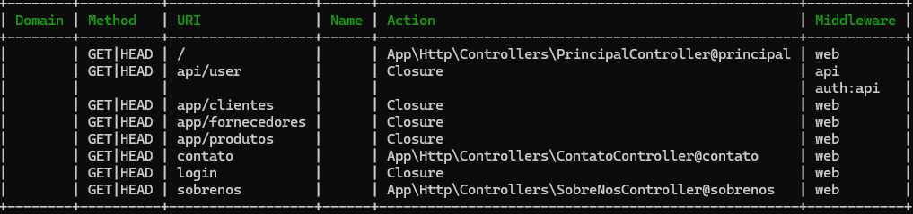

### [Rotas](../routes.md) / [Inserção de Parâmetros](parameters.md) / Agrupamento de Rotas

<h1 id="introduction">Agrupando Rotas</h1>

- Para este tópico será necessário a criação de mais algumas rotas, sendo elas:

        Login           =>  Route::get('/login', function() {return 'Login'})
        Clientes        =>  Route::get('/clientes', function() {return 'clientes'})
        Fornecedores    =>  Route::get('/fornecedores', function() {return 'fornecedores'})
        Produtos        =>  Route::get('/produtos', function() {return 'produtos'})

- Para Agrupar, temos que definir um prefixo de rota onde será agrupado, neste caso será utilizado o prefixo ```/app```, onde agrupará as rotas ```/Clientes```, ```/Fornecedores``` e ```/Produtos```.

      Route::prefix('/app')->group(function() {
        Route::get('/clientes', function() { return 'Clientes'; });
        Route::get('/fornecedores', function() { return 'Fornecedores'; });
        Route::get('/produtos', function() { return 'Produtos'; });
      });

- Agora se executarmos o comando para verificar as rotas aparecerão as respectivas rotas agrupadas:

  ```php artisan route:list```



<p>O Agrupamento se torna uma <b>boa prática</b>, pois <b>organiza melhor as rotas</b>, mantendo uma <b>simplicidade no código</b>, facilitando a manutenção, e ainda assim fornecendo o acesso aos usuários, mantendo uma semântica lógica.</p>

<div style="display: flex; align-items: center; justify-content: space-between; width: 100%; height: 35px;">
  <div style="width: 5%; background-color: transparent;"><a href="parameters.md"></img></a></div>
  <div style="width: 5%; background-color: transparent;"><a href="../routes.md"></a></div>
  <div style="width: 5%; background-color: transparent;"><a href="namming.md"></img></a></div>
</div>