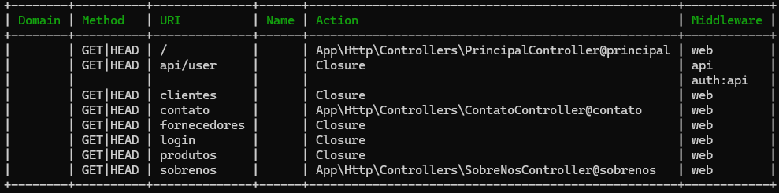

### [Rotas](../routes.md) / Inserção de Parâmetros

<h1 id="introduction">Inserção de Parâmetros nas Rotas:</h1>

Receber parâmetros em rotas no Laravel permite que você crie URLs dinâmicas, o que facilita a organização e o gerenciamento de dados, além de tornar a aplicação mais escalável e flexível. Os parâmetros permitem identificar recursos específicos ou realizar ações específicas com base nos dados passados na URL. 

- As Rotas podem Receber Parâmetros como parte da requisição em sua lógica a partir do comando:
        
        [...]

        Route::get('/<nome_da_rota>'/{<parametro>}, function(<tipo> $<parametro>) {
            //lógica da rota

            //exemplo de uso de parâmetro:
            echo "O valor do parâmetro é: $<parametro>";
        });

        [...]

- Nota Pessoal:

        Referencia de Valores são identificados pela instrução:

            $<nome_da_variável>

### Uso das Variáveis em Strings:
| Uso | Aspas | Informações |
| :-- | :---: | :---------- |
| Comum | ```''``` | ```string texto_variavel = 'texto aqui'.$<nome_da_variavel>;``` |
| Interpolado | ```""``` | ```string texto_variavel = "texto interpolado com $<nome_da_variavel> aqui!";``` |

### Uso de Variáveis Opcionais:

- A aplicação destas variáveis pode ser opcional, correspondente a solicitação do usuário:

        Route::get(
            '/contato/{nome?}/{categoria?}/{assunto?}/{mensagem?}', 
            function(
                string $nome = Desconhecido, 
                string $categoria = Outros, 
                string $assunto = Outro, 
                string $mensagem = 'Mensagem Não Informada!') {
            echo "Estamos Aqui $nome! \n";
            echo "Categoria: $categoria \n";
            echo "Assunto: $assunto \n";
            echo "Mensagem: $mensagem";
        });

### Ordem de Prioridade

- Entretanto, quando estamos utilizando o framework laravel, falamos de uma limitação em questão de rotas, uma vez que o framework só entenderá o que foi passado, se os parâmetros forem organizados por prioridade sendo os conteúdos a esquerda de maior prioridade, e os da direira de menor prioridade de inserção, levando a preferir organizar os conteúdos opcionais a direita, para melhor entendimento do framework!

        Maior Prioridade <----------------------------------- Menor Prioridade
        
                ... get('/<rota>/{arg1}/{arg2}/{arg3}/.../{argx?}') ...

### Filtragem de Parâmetros:

- Filtrar dados em rotas no Laravel é fundamental para criar aplicações web eficientes e flexíveis. Isso permite que você personalize as respostas da sua aplicação com base em critérios específicos, como parâmetros de consulta ou valores de sessão, e execute ações antes de manipular dados, como autenticação ou validação:

        Route::get(
            '/contato/{nome}/{categoria_id}', 
            function(
                string $nome, 
                int $categoria_id) {
            echo "Estamos Aqui $nome! - Categoria: $categoria_id";
        })->where('categoria_id', '[0-9]+');

- Para filtrar utilizamos o método ```where``` ao final da instrução route, contendo as instruções :

    ```...->where('variável_relacionada', 'expressão_e-ou_intervalo_de_valores');```

- A partir disto, quaisquer referências andrógenas aos pré-estabelecidos, serão reconhecidas pelo controle do laravel como páginas não encontradas, e não como erros de código, sendo tratadas como tal, até que seja suprida com dados reais no sistema.


- Já em casos onde há a necessidade de que seja uma variável onde não se pode entrar números, no caso de entada de nomes, e nomenclaturas, textos brutos, etc., utilizando o mesmo ```where```, entretanto com os parâmetros:

        Route::get(
            '/contato/{nome}/{categoria_id}', 
            function(
                string $nome, 
                int $categoria_id) {
            echo "Estamos Aqui $nome! - Categoria: $categoria_id";
        })->where('categoria_id', '[0-9]+')->where('nome', '[A-Za-z]+');

Ressaltando o ```where```:

    ...->where('nome', '[A-Za-z]+');


---


Para os próximos momentos é recomendado que seja feita uma navegação básica entre as páginas utilizando o seguinte código, nas views do projeto:

    ...
        <ul>
            <li>
                <a href="/">Principal</a>
            </li>

            <li>
                <a href="/sobrenos">Sobre Nós</a>
            </li>
            
            <li>
                <a href="/contato">Contato</a>
            </li>

            ...

            <li>
                <a href="/routex">RotaX</a>
            </li
        </ul>

---

- Em um prompt no mesmo diretório do servidor do laravel, com o servidor sendo executado através do comando ```php artisan serve``` em outro prompt, utilizando o comando:

    ```php artisan routes:list```

- É possível visualizar no terminal uma lista onde são retornados as relações de rotas que estão configuradas no servidor laravel.

---

### Listagem Dinâmica de Rotas usando o Artisan:

- Para a listagem de rotas usando o artisan podemos utilizar o seguinte comando no terminal do diretório do servidor, com ele funcionando:

        php artisan route:list

    - Com isso o servidor vai retornar uma lista contento todas as rotas configuradas:

    

<div style="display: flex; align-items: center; justify-content: space-between; width: 100%; height: 35px;">
  <div style="width: 5%; background-color: transparent;"><a href="../views.md"></img></a></div>
  <div style="width: 5%; background-color: transparent;"><a href="../routes.md"></a></div>
  <div style="width: 5%; background-color: transparent;"><a href="grouping.md"></img></a></div>
</div>